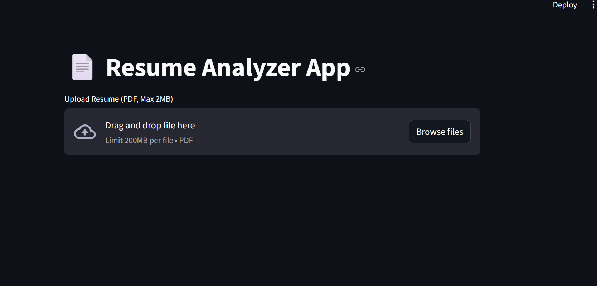

# 🧾 Resume Analyzer App

_Resume Analyzer App is a Streamlit-based web application that analyzes uploaded resumes by extracting skills, experience, and matching them with a given job description._

---

## 📌 Table of Contents
- <a href="#overview">Overview</a>
- <a href="#business-problem">Business Problem</a>
- <a href="#tools--technologies">Tools & Technologies</a>
- <a href="#project-structure">Project Structure</a>
- <a href="#dashboard">Dashboard</a>
- <a href="#how-to-run-this-project">How to Run This Project</a>
- <a href="#Future-Improvement">Final Recommendations</a>
- <a href="#author--contact">Author & Contact</a>

---
<h2><a class="anchor" id="overview"></a>Overview</h2>

The Resume Analyzer App is a lightweight web application built with Python and Streamlit. It
enables users to upload a PDF resume, analyze its content, extract relevant skills and experience,
and match the resume with a given job description (JD). This helps recruiters and candidates
assess how well a resume aligns with a job role.

---
<h2><a class="anchor" id="business-problem"></a>Business Problem</h2>

Manual resume screening is slow, inefficient, and often biased. This project aims to:
- Automatically extracts text from resumes (PDF format).
- Identifies and lists relevant skills from the resume.
- Estimates candidate’s years of experience.
- Compares resume skills with job description keywords.
- Calculates and displays a match score to help in shortlisting.
- Saves recruiters time and improves hiring efficiency.

---

<h2><a class="anchor" id="tools--technologies"></a>Tools & Technologies</h2>

- Python
- Streamlit
- PyMuPDF (fitz)
- Regex (re module)
- GitHub

---
<h2><a class="anchor" id="project-structure"></a>Project Structure</h2>

```
resume-analyzer-python-streamlit/
│
├── README.md
├── .gitignore
├── requirements.txt
│
├── scripts/                    # Python scripts 
│   ├── app.py
│   └── resume_parser.py
│
├── images                      #screetshot streamlit UI
├── job_description.txt 
```

---

<h2><a class="anchor" id="#Dashboard"></a>Dashboard</h2>

- streamlit UI shows:
 - file uploader
 - candidates summary



---
<h2><a class="anchor" id="how-to-run-this-project"></a>How to Run This Project</h2>

1. Clone the repository:
```bash
git clone https://github.com/yourusername/resume-analyzer-python-streamlit.git
```
2. Install dependencies: 
```bash
pip install -r requirements.txt
```
3. Open and Run VS Code:
```bash
python scripts/`streamlit run app.py'
```
4. Upload your resume and paste job description

5. View extracted skills, experience, and match score

---
<h2><a class="anchor" id="Future-Improvement"></a>Future Improvement</h2>

- Use AI/ML (BERT/OpenAI) for semantic JD matching
- Export feedback as PDF or CSV
- Use OCR for image-based resumes
- Allow multi-resume batch uploads
- Deploy on Streamlit Cloud with GitHub integration

---
<h2><a class="anchor" id="author--contact"></a>Author & Contact</h2>

**Vinod Kumar Prajapat**  
Python Developer  
📧 Email: vinodkumarpr21@gmail.com  
🔗 [LinkedIn](https://www.linkedin.com/in/vinod-kumar-prajapat/) 